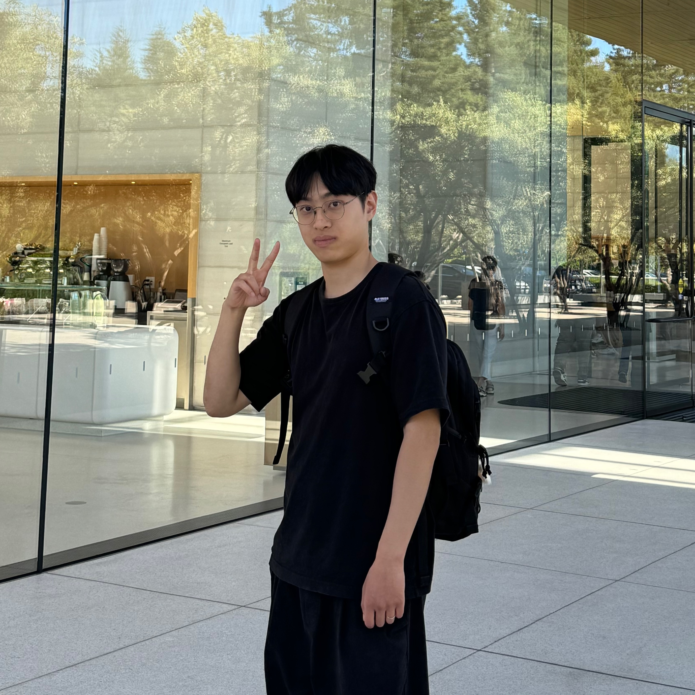

I'm Sangyun Lee (pronounced as "Sang-Yoon"), a second-year Ph.D. student in Electrical and Computer Engineering at [Carnegie Mellon University](https://www.cmu.edu/) advised by [Giulia Fanti](https://gfanti.github.io/). I'm currently a research intern at NVIDIA. I obtained my Bachelor's degree in Computer Science at [Soongsil University](https://webtrans.llsollu.com:40443/ezweb?source=KO&target=EN&profileId=0012d8d1-14e0-4237-a6a5-a68bc015f94d&url=https%3A%2F%2Fssu.ac.kr%2F). During my undergraduate years, I worked with Professors [Jaegul Choo](https://sites.google.com/site/jaegulchoo/) and [Jong Chul Ye](https://scholar.google.com/citations?user=HNMjoNEAAAAJ&hl=ko). Previously, I was a research intern at [SI Analytics](https://www.si-analytics.ai/eng), [Kakao Enterprise](https://www.kakaoenterprise.com/), and [NAVER AI Lab](https://clova.ai/en/research/research-area-detail.html?id=0).

<div style="margin-bottom: 20px;">
  <a href="https://github.com/sangyun884/" style="display: inline-block; margin-right: 10px; padding: 8px 12px; background-color: #FA8072; color: white; text-decoration: none; border-radius: 5px; font-weight: bold; transition: background-color 0.3s;">GitHub</a>
  <a href="https://twitter.com/sang_yun_lee" style="display: inline-block; margin-right: 10px; padding: 8px 12px; background-color: #1DA1F2; color: white; text-decoration: none; border-radius: 5px; font-weight: bold; transition: background-color 0.3s;">Twitter</a>
  <a href="https://scholar.google.co.kr/citations?user=CGFkx-IAAAAJ&hl=en" style="display: inline-block; padding: 8px 12px; background-color: #4285F4; color: white; text-decoration: none; border-radius: 5px; font-weight: bold; transition: background-color 0.3s;">Google Scholar</a>
</div>

```
Contact: sangyunl@andrew.cmu.edu
```

## Research Interest

I work on deep generative modeling and its application in developing machine intelligence that surpasses human capabilities.

## News
- **[Oct. 2024]** One paper has been accepted to NeurIPS 2024.
- **[Jan. 2024]** I will start my internship at NVIDIA this summer (Host: [Arash Vahdat](http://latentspace.cc/))

## Research
<div class="research-list">
<div class="research-item">
  <h3>Truncated Consistency Models</h3>
  <p><u>Sangyun Lee</u>, Yilun Xu, Tomas Geffner, Giulia Fanti, Karsten Kreis, Arash Vahdat, Weili Nie</p>
  <p><em><strong>arxiv preprint</strong></em></p>
  <div class="research-links">
    <a href="https://arxiv.org/abs/2410.14895">Abstract</a>
  </div>
</div>
<div class="research-item">
  <h3>Improving the Training of Rectified Flows</h3>
  <p><u>Sangyun Lee</u>, Zinan Lin, Giulia Fanti</p>
  <p><em><strong>NeurIPS 2024</strong></em></p>
  <div class="research-links">
    <a href="https://arxiv.org/abs/2405.20320">Abstract</a>
    <a href="https://github.com/sangyun884/rfpp">Code</a>
  </div>
</div>
<div class="research-item">
  <h3>Sequential Data Generation with Groupwise Diffusion Process</h3>
  <p><u>Sangyun Lee</u>, Gayoung Lee, Hyunsu Kim, Junho Kim, Youngjung Uh</p>
  <p><em><strong>arxiv preprint, also appeared at <a href="https://openreview.net/forum?id=hLeh6b0vlt#all">ICML 2023 Workshop on Structured Probabilistic Inference & Generative Modeling</a></strong></em></p>
  <div class="research-links">
    <a href="https://arxiv.org/abs/2310.01400">Abstract</a>
  </div>
</div>
<div class="research-item">
  <h3>Minimizing Trajectory Curvature of ODE-based Generative Models</h3>
  <p><u>Sangyun Lee</u>, Beomsu Kim, Jong Chul Ye</p>
  <p><em><strong>ICML 2023</strong></em></p>
  <div class="research-links">
    <a href="https://arxiv.org/abs/2301.12003">Abstract</a>
    <a href="https://github.com/sangyun884/fast-ode">Code</a>
  </div>
</div>
<div class="research-item">
  <h3>Progressive Deblurring of Diffusion Models for Coarse-to-Fine Image Synthesis</h3>
  <p><u>Sangyun Lee</u>, Hyungjin Chung, Jaehyeon Kim, Jong Chul Ye</p>
  <p><em><strong>NeurIPS 2022 Workshop on Score-Based Methods</strong></em></p>
  <div class="research-links">
    <a href="https://arxiv.org/abs/2207.11192">Abstract</a>
    <a href="https://github.com/sangyun884/blur-diffusion">Code</a>
  </div>
</div>
<div class="research-item">
  <h3>High-Resolution Virtual Try-On with Misalignment and Occlusion-Handled Conditions</h3>
  <p><u>Sangyun Lee</u>*, Gyojung Gu*, Sunghyun Park, Seunghwan Choi, Jaegul Choo</p>
  <p><em><strong>ECCV 2022</strong></em></p>
  <div class="research-links">
    <a href="https://arxiv.org/abs/2206.14180">Abstract</a>
    <a href="https://github.com/sangyun884/HR-VITON">Code</a>
  </div>
</div>
<div class="research-item">
  <h3>Learning Multiple Probabilistic Degradation Generators for Unsupervised Real World Image Super Resolution</h3>
  <p><u>Sangyun Lee</u>, Sewoong Ahn, Kwangjin Yoon</p>
  <p><em><strong>ECCV 2022 Workshop on Learning from Limited and Imperfect Data</strong></em></p>
  <div class="research-links">
    <a href="https://arxiv.org/abs/2201.10747">Abstract</a>
  </div>
</div>
</div>
<p><em>(* denotes equal contributions.)</em></p>
<style>
  .research-list {
    display: flex;
    flex-direction: column;
    gap: 1.5rem;
  }
  .research-item {
    background-color: #1DA1F2; 
    border: 1px solid #ffffff;
    border-radius: 8px;
    padding: 1rem;
    transition: border-color 0.3s ease;
  }
  .research-item:hover {
    border-color: var(--link-color);
  }
  .research-item h3 {
    margin-top: 0;
    margin-bottom: 0.5rem;
  }
  .research-item p {
    margin: 0.25rem 0;
  }
  .research-links {
    margin-top: 0.5rem;
  }
  .research-links a {
    display: inline-block;
    margin-right: 0.5rem;
    padding: 0.25rem 0.5rem;
    background-color: var(--link-color);
    color: var(--background-color);
    text-decoration: none;
    border-radius: 4px;
    font-size: 0.9em;
    transition: background-color 0.3s ease;
  }
  .research-links a:hover {
    background-color: var(--link-hover-color);
  }
</style>


## Talk

### [Modulabs](https://modulabs.co.kr/) (2022.11.24 ~ 2022.12.08)

- A Unified Framework for Diffusion Models [[Slide]](https://docs.google.com/presentation/d/1sI3cZ0EzWuqMHhuI3bPSnksDKJon9BJy_WCaFB4Kpgo/edit?usp=sharing) [[Video (Korean)]](https://youtu.be/KzrdkZUrbPk)
- Diffusion Models for Conditional Generation [[Slide]](https://docs.google.com/presentation/d/1VQvMsZI6S-LLg-RsNEyR_NRaiFgiX3fW2lhUGdS7pEE/edit?usp=sharing) [[Video (Korean)]](https://youtu.be/Ec569AV6YD8)
- Diffusion Models Everywhere [[Slide]](https://docs.google.com/presentation/d/1FNRmL8wS0jKLi3Uk_QdxyAP75i9pYEqFxhHhma4Slq8/edit?usp=sharing) [[Video (Korean)]](https://youtu.be/xVjrS-n9o68)

## Patent

**Sangyun Lee** and Kwangjin Yoon, "Super Resolution Imaging Method Using Collaborative Learning." Korean Patent 1024062870000, filed Dec 31, 2021, and issued June 2, 2022.

<style>
  .research-list-cards > ul {
    list-style-type: none;
    padding-left: 0;
  }
  .research-list-cards > ul > li {
    margin-bottom: 20px;
    padding: 15px;
    border-radius: 8px;
    box-shadow: 0 2px 5px rgba(0,0,0,0.1);
    transition: box-shadow 0.3s ease;
  }
  .research-list-cards > ul > li:hover {
    box-shadow: 0 5px 15px rgba(0,0,0,0.1);
  }
</style>
