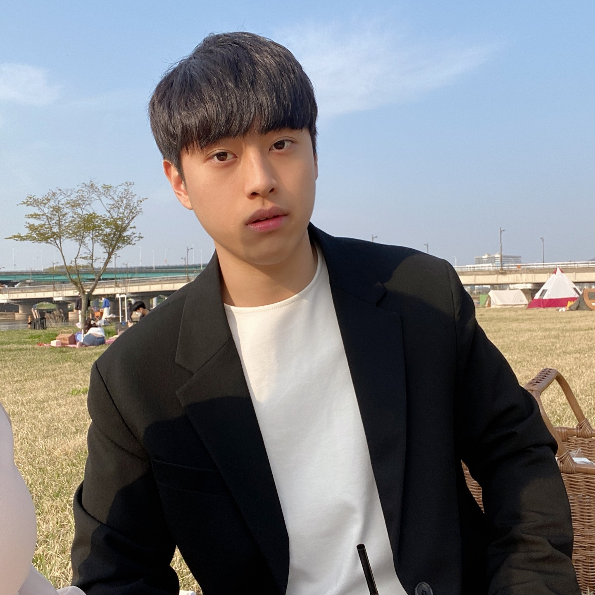

[GitHub](https://github.com/sangyun884/) [Twitter](https://twitter.com/sang_yun_lee) [Google Scholar](https://scholar.google.co.kr/citations?user=CGFkx-IAAAAJ&hl=ko)

I am an incoming Ph.D. student at [Carnegie Mellon University](https://www.cmu.edu/) starting from Fall 2023. I am currently pursuing a Bachelor's degree in Computer Science at [Soongsil University](http://eng.ssu.ac.kr). Previously, I was a research intern at [SI Analytics](https://www.si-analytics.ai/eng), [Kakao Enterprise](https://www.kakaoenterprise.com/), and [NAVER AI Lab](https://clova.ai/en/research/research-area-detail.html?id=0). During my undergraduate years, I was fortunated to be advised by Professor [Jaegul Choo](https://sites.google.com/site/jaegulchoo/) and Professor [Jong Chul Ye](https://scholar.google.com/citations?user=HNMjoNEAAAAJ&hl=ko).

**Research interest.** My goal is to develop powerful generative models and apply them to various applications, including disentangled representation learning, conditional sampling, and reasoning. For that, I currently aim to build a generative model that can synthesize high-fidelity, diverse high-dimensional samples such as videos in a *single forward pass*.

Contact: sangyunl@andrew.cmu.edu
---

# News
- **[Jun. 2023]** One paper is accepted to ICML 2023 SPIGM Workshop (will be available soon).
- **[Apr. 2023]** One paper is accepted to ICML.
- **[Apr. 2023]** I will be joining CMU ECE as a Ph.D. student in Fall 2023.
- **[Jan. 2023]** I will start my internship at [NAVER AI Lab](https://clova.ai/en/research/research-area-detail.html?id=0).
- **[Oct. 2022]** Blur diffusion is accepted to NeurIPS 2022 Workshop on Score-Based Methods.
- **[Aug. 2022]** MSSR is accepted to ECCV'22 Workshop on Learning from Limited and Imperfect Data.
- **[Jul. 2022]** HR-VITON is accepted to ECCV 2022.
- **[Dec. 2021]** I started my internship at AI Lab, [Kakao Enterprise](https://www.kakaoenterprise.com/) (Mentor: [Jaehyeon Kim](https://scholar.google.com/citations?user=-ZJaGikAAAAJ&hl=en)).
- **[Mar. 2021]** I started my internship at [SI Analytics](https://www.si-analytics.ai/eng) (Mentor: [Kwangjin Yoon](https://scholar.google.co.kr/citations?user=h55SR68AAAAJ&hl=en)).

---

# Research
- **Sangyun Lee**, Beomsu Kim, and Jong Chul Ye, “Minimizing Trajectory Curvature of ODE-based Generative Models”, *ICML 2023* [[Abstract](https://arxiv.org/abs/2301.12003)] [[Code](https://github.com/sangyun884/fast-ode)]
- **Sangyun Lee**, Hyungjin Chung, Jaehyeon Kim, and ‪Jong Chul Ye, “Progressive Deblurring of Diffusion Models for Coarse-to-Fine Image Synthesis”, *NeurIPS 2022 Workshop on Score-Based Methods* [[Abstract](https://arxiv.org/abs/2207.11192)] [[code](https://github.com/sangyun884/blur-diffusion)]
- **Sangyun Lee**\*, Gyojung Gu\*, Sunghyun Park, Seunghwan Choi, and Jaegul Choo, “High-Resolution Virtual Try-On with Misalignment and Occlusion-Handled Conditions”, *European Conference on Computer Vision (ECCV), 2022* [[Abstract](https://arxiv.org/abs/2206.14180)] [[Code](https://github.com/sangyun884/HR-VITON)]
- **Sangyun Lee**, Sewoong Ahn, and Kwangjin Yoon, “Learning Multiple Probabilistic Degradation Generators for Unsupervised Real World Image Super Resolution”, *ECCV'22 Workshop on Learning from Limited and Imperfect Data* [[Abstract](https://arxiv.org/abs/2201.10747)]

(\* denotes equal contributions.)

# Invited Talk
## [Modulabs](https://modulabs.co.kr/) (2022.11.24 ~ 2022.12.08)
- A Unified Framework for 
Diffusion Models
 [[Slide]](https://docs.google.com/presentation/d/1sI3cZ0EzWuqMHhuI3bPSnksDKJon9BJy_WCaFB4Kpgo/edit?usp=sharing) [[Video]](https://youtu.be/KzrdkZUrbPk)
 - Diffusion Models for
Conditional Generation
 [[Slide]](https://docs.google.com/presentation/d/1VQvMsZI6S-LLg-RsNEyR_NRaiFgiX3fW2lhUGdS7pEE/edit?usp=sharing)  [[Video]](https://youtu.be/Ec569AV6YD8)
 - Diffusion Models Everywhere [[Slide]](https://docs.google.com/presentation/d/1FNRmL8wS0jKLi3Uk_QdxyAP75i9pYEqFxhHhma4Slq8/edit?usp=sharing) [[Video]](https://youtu.be/xVjrS-n9o68)
 
 
# Patent
**Sangyun Lee** and Kwangjin Yoon, super resolution imaging method using collaborative learning. Korean Patent 1024062870000, filed Dec 31, 2021, and issued June 2, 2022.
