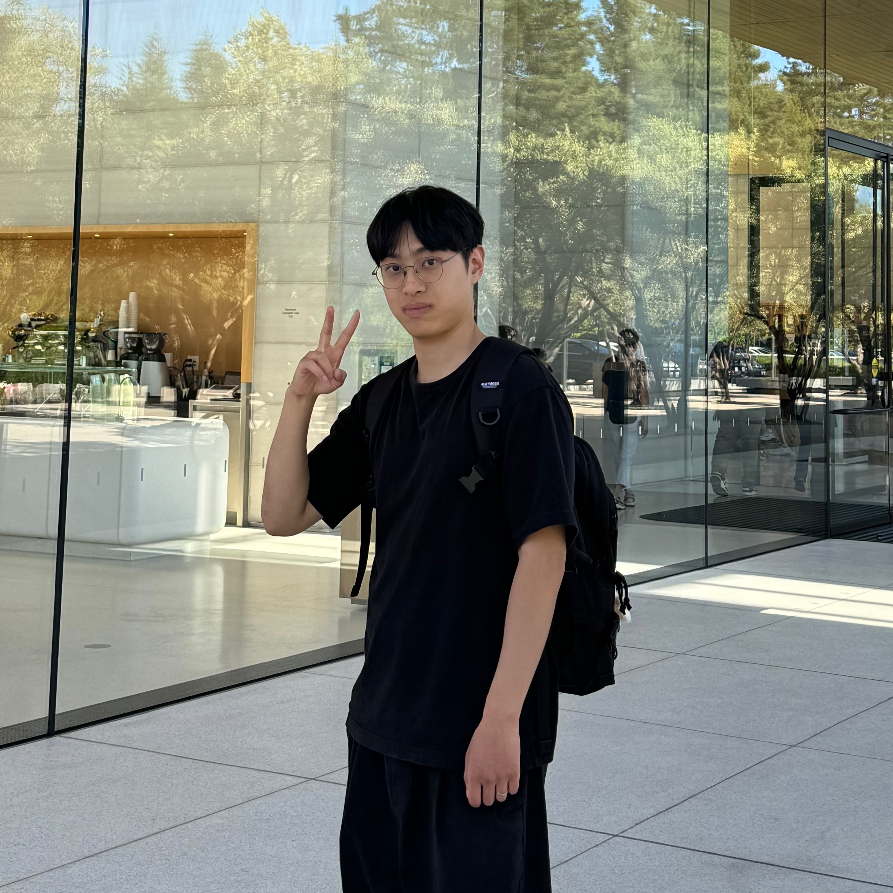

I'm Sangyun Lee (pronounced "Sang-Yoon"), a fourth-year Ph.D. student in Electrical and Computer Engineering at Carnegie Mellon University, advised by [Giulia Fanti](https://gfanti.github.io/). Previously, I was a research intern at Microsoft Research, NVIDIA, NAVER AI Lab, Kakao Enterprise, and SI Analytics. I earned my Bachelor's degree in Computer Science from Soongsil University in South Korea.

<div style="margin-bottom: 20px;">
  <a href="https://github.com/sangyun884/" style="display: inline-block; margin-right: 10px; padding: 8px 12px; background-color: #FA8072; color: white; text-decoration: none; border-radius: 5px; font-weight: bold; transition: background-color 0.3s;">GitHub</a>
  <a href="https://twitter.com/sang_yun_lee" style="display: inline-block; margin-right: 10px; padding: 8px 12px; background-color: #1DA1F2; color: white; text-decoration: none; border-radius: 5px; font-weight: bold; transition: background-color 0.3s;">Twitter</a>
  <a href="https://scholar.google.co.kr/citations?user=CGFkx-IAAAAJ&hl=en" style="display: inline-block; padding: 8px 12px; background-color: #4285F4; color: white; text-decoration: none; border-radius: 5px; font-weight: bold; transition: background-color 0.3s;">Google Scholar</a>
</div>

```
Contact: sangyunl@andrew.cmu.edu
```

## Research Interest


I work on developing visual and digital intelligence.  For visual intelligence, I work on understanding and improving generative models that synthesize realistic visual data [[blur diffusion](https://arxiv.org/abs/2207.11192), [curvature minimization](https://arxiv.org/abs/2301.12003), [improved rectified flow](https://arxiv.org/abs/2405.20320), [truncated consistency models](https://arxiv.org/abs/2410.14895)]. For digital intelligence, I study better learning algorithms for training language models [[BaNEL](https://arxiv.org/abs/2510.09596), [LLMs need sleep](https://arxiv.org/abs/2605.26099)].

## News
- **[May 2026]** Excited to release [Language Models Need Sleep](https://arxiv.org/abs/2605.26099)!
- **[May 2026]** Started my internship at MSR, Redmond.


## Publications
<div class="research-list">
<div class="research-item">
  <h3>Do Language Models Need Sleep? Offline Recurrence for Improved Online Inference</h3>
  <p><u>Sangyun Lee</u>, Sean McLeish, Tom Goldstein, Giulia Fanti</p>
  <p><em><strong>NeurIPS 2026, also appeared at <a href="https://spigmworkshop2026.github.io/">ICML 2026 Workshop on Structured Probabilistic Inference &amp; Generative Modeling</a></strong></em></p>
  <div class="research-links">
    <a href="https://arxiv.org/abs/2605.26099">Abstract</a>
    <a href="https://github.com/sangyun884/llm-sleep">Code</a>
    <a href="https://drive.google.com/file/d/1zX-3fFETZXxclVeI1vQJfMKZDrAfd9-A/view?usp=sharing">Slide</a>
  </div>
  <details class="research-summary">
    <summary>Summary</summary>
    <p>Many have hypothesized that the remarkable learning ability of human brains has something to do with sleep. Can LLMs benefit from sleep, too? Our method is derived from three hypotheses: (1) the brain is just a gigantic recurrent network; (2) it updates its synapses during forward passes via local learning rules; and (3) sleep is simply a period during which forward passes and learning continue in the absence of input. Our method is the simplest possible instantiation satisfying these hypotheses: adding offline recurrent forward passes to state-space language models. The trained model uses this recurrence to learn good representations of the past by updating its fast weights, leading to improved performance after sleep.</p>
  </details>
</div>
<div class="research-item">
  <h3>BaNEL: Exploration Posteriors for Generative Modeling Using Only Negative Rewards</h3>
  <p><u>Sangyun Lee</u>, Brandon Amos, Giulia Fanti</p>
  <p><em><strong>arxiv preprint</strong></em></p>
  <div class="research-links">
    <a href="https://arxiv.org/abs/2510.09596">Abstract</a>
    <a href="https://blog.ml.cmu.edu/2025/10/27/learning-from-failure-to-tackle-extremely-hard-problems/">Blog</a>

  </div>
  <details class="research-summary">
    <summary>Summary</summary>
    <p>LLM RL works because the base model can already generate good outputs occasionally. However, when the problem is very hard and very far from the pretraining dataset, that is no longer the case (think about proving the Riemann hypothesis, for instance). What should we do when the base model obtains no positive reward? Our idea is that we can still learn from those failed attempts by learning a generative model of the negative samples and then using it to update the model's posterior distribution to avoid similar failures in the future.</p>
  </details>
</div>
<div class="research-item">
  <h3>Truncated Consistency Models</h3>
  <p><u>Sangyun Lee</u>, Yilun Xu, Tomas Geffner, Giulia Fanti, Karsten Kreis, Arash Vahdat, Weili Nie</p>
  <p><em><strong>ICLR 2025</strong></em></p>
  <div class="research-links">
    <a href="https://truncated-cm.github.io/">Project Page</a>
    <a href="https://arxiv.org/abs/2410.14895">Abstract</a>
    <a href="https://github.com/NVlabs/TCM">Code</a>
  </div>
  <details class="research-summary">
    <summary>Summary</summary>
    <p>This paper aims to improve the one-step generation quality of <a href="https://arxiv.org/abs/2303.01469">consistency models</a>. We observe that, in consistency models, two conflicting objectives&mdash;denoising (<em>t</em> &rarr; 0 mapping) and generation (<em>T</em> &rarr; 0 mapping)&mdash;compete for model capacity. This is especially problematic because CM is a <a href="https://developer.nvidia.com/blog/accelerating-diffusion-models-with-an-open-plug-and-play-offering/">trajectory-based distillation</a> method that already requires a much larger model to match the quality of other methods. To resolve this, we propose a method for specializing CM for generation while freeing its capacity from denoising. At the time of release and at the scale we considered, the resulting model was the state of the art among trajectory-based models.</p>
  </details>
</div>
<div class="research-item">
  <h3>Improving the Training of Rectified Flows</h3>
  <p><u>Sangyun Lee</u>, Zinan Lin, Giulia Fanti</p>
  <p><em><strong>NeurIPS 2024</strong></em></p>
  <div class="research-links">
    <a href="https://arxiv.org/abs/2405.20320">Abstract</a>
    <a href="https://github.com/sangyun884/rfpp">Code</a>
  </div>
  <details class="research-summary">
    <summary>Summary</summary>
    <p>Rectified flows can learn less curved generative trajectories than diffusion models by going through many "Reflow" training stages. This paper argues that only one Reflow stage should be enough to obtain near-straight trajectories and proposes several techniques for achieving good one-step generative performance with only one Reflow stage. Some of the techniques proposed here have been adopted in <a href="https://arxiv.org/abs/2502.10248">Step-Video-T2V's turbo model</a>.</p>
  </details>
</div>
<div class="research-item">
  <h3>Sequential Data Generation with Groupwise Diffusion Process</h3>
  <p><u>Sangyun Lee</u>, Gayoung Lee, Hyunsu Kim, Junho Kim, Youngjung Uh</p>
  <p><em><strong>arxiv preprint, also appeared at <a href="https://openreview.net/forum?id=hLeh6b0vlt#all">ICML 2023 Workshop on Structured Probabilistic Inference & Generative Modeling</a></strong></em></p>
  <div class="research-links">
    <a href="https://arxiv.org/abs/2310.01400">Abstract</a>
  </div>
  <details class="research-summary">
    <summary>Summary</summary>
    <p>Diffusion models vs. autoregressive models: Are they really different? This paper unifies the two by generalizing diffusion to be able to generate each part of data sequentially. This allows, for example, each patch or pixel of an image to be generated sequentially in any order, making autoregressive models a special case. We extend this to a frequency domain, where diffusion autoregressively generates spectral components from low to high frequencies, yielding a hierarchical, disentangled latent space.</p>
  </details>
</div>
<div class="research-item">
  <h3>Minimizing Trajectory Curvature of ODE-based Generative Models</h3>
  <p><u>Sangyun Lee</u>, Beomsu Kim, Jong Chul Ye</p>
  <p><em><strong>ICML 2023</strong></em></p>
  <div class="research-links">
    <a href="https://arxiv.org/abs/2301.12003">Abstract</a>
    <a href="https://github.com/sangyun884/fast-ode">Code</a>
  </div>
  <details class="research-summary">
    <summary>Summary</summary>
    <p>Why should sampling from diffusion/flow models be iterative? This is because their generative trajectories are highly curved. This paper proposes a method for training low-curvature flow models by learning a neural coupling between data and noise that minimizes intersections.</p>
  </details>
</div>
<div class="research-item">
  <h3>Progressive Deblurring of Diffusion Models for Coarse-to-Fine Image Synthesis</h3>
  <p><u>Sangyun Lee</u>, Hyungjin Chung, Jaehyeon Kim, Jong Chul Ye</p>
  <p><em><strong>NeurIPS 2022 Workshop on Score-Based Methods</strong></em></p>
  <div class="research-links">
    <a href="https://arxiv.org/abs/2207.11192">Abstract</a>
    <a href="https://github.com/sangyun884/blur-diffusion">Code</a>
  </div>
  <details class="research-summary">
    <summary>Summary</summary>
    <p>Diffusion models generate data through iterative denoising. But is that the only way, or can we generate data by inverting any signal-corruption process? This paper is one of the first to show that deblurring can be used for image generation. This is done by generalizing forward and reverse SDEs to different frequency domains.</p>
  </details>
</div>
<div class="research-item">
  <h3>High-Resolution Virtual Try-On with Misalignment and Occlusion-Handled Conditions</h3>
  <p><u>Sangyun Lee</u>*, Gyojung Gu*, Sunghyun Park, Seunghwan Choi, Jaegul Choo</p>
  <p><em><strong>ECCV 2022</strong></em></p>
  <div class="research-links">
    <a href="https://arxiv.org/abs/2206.14180">Abstract</a>
    <a href="https://github.com/sangyun884/HR-VITON">Code</a>
  </div>
</div>
<div class="research-item">
  <h3>Learning Multiple Probabilistic Degradation Generators for Unsupervised Real World Image Super Resolution</h3>
  <p><u>Sangyun Lee</u>, Sewoong Ahn, Kwangjin Yoon</p>
  <p><em><strong>ECCV 2022 Workshop on Learning from Limited and Imperfect Data</strong></em></p>
  <div class="research-links">
    <a href="https://arxiv.org/abs/2201.10747">Abstract</a>
  </div>
</div>
</div>
<p><em>(* denotes equal contributions.)</em></p>
<style>
  .research-list {
    display: flex;
    flex-direction: column;
    gap: 1.5rem;
  }
  .research-item {
    background-color: #1DA1F2; 
    border: 1px solid #ffffff;
    border-radius: 8px;
    padding: 1rem;
    transition: border-color 0.3s ease;
  }
  .research-item:hover {
    border-color: var(--link-color);
  }
  .research-item h3 {
    margin-top: 0;
    margin-bottom: 0.5rem;
  }
  .research-item p {
    margin: 0.25rem 0;
  }
  .research-item .research-summary {
    margin: 0.75rem 0 0;
    background-color: rgba(255, 255, 255, 0.14);
    border-left: 3px solid rgba(255, 255, 255, 0.75);
    border-radius: 0 6px 6px 0;
    overflow: hidden;
  }
  .research-summary > summary {
    display: flex;
    align-items: center;
    justify-content: space-between;
    gap: 0.75rem;
    padding: 0.65rem 0.9rem;
    cursor: pointer;
    font-weight: 700;
    letter-spacing: 0.02em;
    list-style: none;
    transition: background-color 0.2s ease;
  }
  .research-summary > summary::-webkit-details-marker {
    display: none;
  }
  .research-summary > summary::after {
    content: "\25BE";
    font-size: 0.85em;
    transition: transform 0.2s ease;
  }
  .research-summary > summary:hover {
    background-color: rgba(255, 255, 255, 0.08);
  }
  .research-summary > summary:focus-visible {
    outline: 2px solid currentColor;
    outline-offset: -3px;
  }
  .research-summary[open] > summary {
    margin-bottom: 0.65rem;
    border-bottom: 1px solid rgba(255, 255, 255, 0.25);
  }
  .research-summary[open] > summary::after {
    transform: rotate(180deg);
  }
  .research-summary > p {
    margin: 0;
    padding: 0 0.9rem 0.75rem;
    line-height: 1.55;
  }
  .research-summary a {
    color: inherit;
    font-weight: 600;
    text-decoration: underline;
    text-underline-offset: 2px;
  }
  .research-links {
    margin-top: 0.5rem;
  }
  .research-links a {
    display: inline-block;
    margin-right: 0.5rem;
    padding: 0.25rem 0.5rem;
    background-color: var(--link-color);
    color: var(--background-color);
    text-decoration: none;
    border-radius: 4px;
    font-size: 0.9em;
    transition: background-color 0.3s ease;
  }
  .research-links a:hover {
    background-color: var(--link-hover-color);
  }
</style>

## Scholarships
- **Bob Lee Gregory Fellowship** for the 2024-2025 academic year.
- **ECE Department Recognition Award** for Exemplary Qualifying Exam Performance, Spring 2025. Recognized by CMU ECE faculty for exemplary Ph.D. qualifying examination performance. This distinction was awarded by faculty vote to select students within the top 10% of Ph.D. student examinees during the Spring 2025 academic semester.


## Talk
- Jul 2026, Google DeepMind, "Do Language Models Need Sleep?" [Slides](https://drive.google.com/file/d/1zX-3fFETZXxclVeI1vQJfMKZDrAfd9-A/view?usp=sharing)
- Jun 2026; FAIR, Meta Superintelligence Labs, Paris, "Do Language Models Need Sleep?" [Slides](https://drive.google.com/file/d/1857MzW2vTtEiZ4Y2sRSkOOWws7lF5Qyz/view?usp=sharing)
- Mar 2025; Sewoong Oh's group @ University of Washington, "Truncated Consistency Models"
- Mar 2025; Stability AI, "Truncated Consistency Models"
- Nov 2024; BioImaging, Signal Processing & Learning Lab @ KAIST, "Improving the Training of Rectified Flows"
- Nov 2022 - Dec 2022; A three-week series of talks at [Modulabs](https://modulabs.co.kr/)
  - A Unified Framework for Diffusion Models [[Slide]](https://docs.google.com/presentation/d/1sI3cZ0EzWuqMHhuI3bPSnksDKJon9BJy_WCaFB4Kpgo/edit?usp=sharing) [[Video (Korean)]](https://youtu.be/KzrdkZUrbPk)
  - Diffusion Models for Conditional Generation [[Slide]](https://docs.google.com/presentation/d/1VQvMsZI6S-LLg-RsNEyR_NRaiFgiX3fW2lhUGdS7pEE/edit?usp=sharing) [[Video (Korean)]](https://youtu.be/Ec569AV6YD8)
  - Diffusion Models Everywhere [[Slide]](https://docs.google.com/presentation/d/1FNRmL8wS0jKLi3Uk_QdxyAP75i9pYEqFxhHhma4Slq8/edit?usp=sharing) [[Video (Korean)]](https://youtu.be/xVjrS-n9o68)

## Patent

**Sangyun Lee** and Kwangjin Yoon, "Super Resolution Imaging Method Using Collaborative Learning." Korean Patent 1024062870000, filed Dec 31, 2021, and issued June 2, 2022.

<style>
  .research-list-cards > ul {
    list-style-type: none;
    padding-left: 0;
  }
  .research-list-cards > ul > li {
    margin-bottom: 20px;
    padding: 15px;
    border-radius: 8px;
    box-shadow: 0 2px 5px rgba(0,0,0,0.1);
    transition: box-shadow 0.3s ease;
  }
  .research-list-cards > ul > li:hover {
    box-shadow: 0 5px 15px rgba(0,0,0,0.1);
  }
</style>
