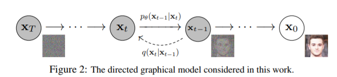
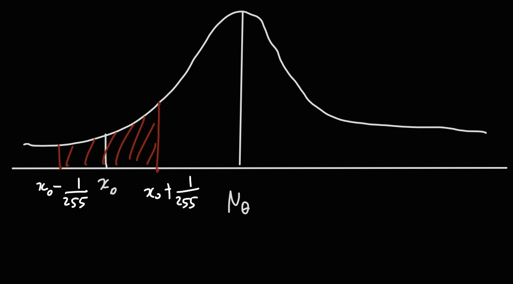
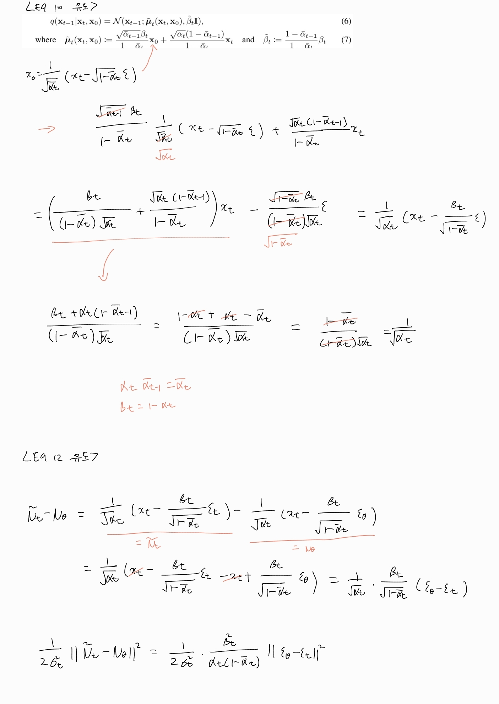

# Denoising Diffusion Probabilistic Models

# Contribution

1. Reverse process predicts $\epsilon$ instead of $\tilde\mu_t$. Here author found the connection with NCSN. 
2. Reweighted VLB ($L_{simple}$)

DDPM is latent variable model with $T$ latent variable, i.e. $p_{\theta}(x_0):=\int p_{\theta}(x_{0:T})dx_{1:T}$. While DDPM is basically a hierarchical VAE, there are several differences as follows.

1. While the encoder of VAE has learnable parameters, the forward process of DDPM is a fixed procedure in which each step corrupts the signal of input slightly.
2. Unlike VAE where each layer of decoder has different parameters, DDPM shares the parameters between each time step. 
3. The encoding process of DDPM preserves the dimension of input data (there is no bottleneck).

# Forward Process

Forward process is defined as above. $\beta_t$ is predetermined constant that increases linearly from $\beta_1=10^{-4}$ to $\beta_T=0.02$. Those values could be learnable parameters or constants, and author found both works well.  For example, if $\beta_t=0.01$ then we can reparameterize $x_t$ as $x_t=\sqrt{0.99}x_{t-1} + 0.01\epsilon$. As the forward process is repetition of such corruption, $x_T$ doesn't have the remaining signal and follows a gaussian distribution.

The purpose for scaling with $\sqrt{1-\beta_t}$ is to maintain a unit variance after adding noise. First, variance become  $1-\beta_t$ after multiplying with $\sqrt{1-\beta_t}$. Then variance becomes unit after adding noise of which variance is $\beta_t$. If the scaling is removed, a variance will increase by $\beta_t$. As we use a single model for every time step, it is better to bound the value of $x_t$ to a certain degree.

To obtain $x_t$ it seems like that the corruption should be applied to $x_0$ $t$ times, but there is a way to do it at once. If $\alpha_t:=1-\beta_t$ and $\bar{\alpha}\_{t}:=\prod\_{s=1}^{t} \alpha_{s}$

$q(x_t\|x_0)$ represented as above. While there is no detailed derivation in paper, we can represent $x_t$with $x_{t-1}$ and noise, and again $x_{t-1}$ can be represented with $x_{t-2}$ and noise. Eventually, $x_t$ can be represented with $x_0$ and noise. This representation brings a great simplicity. Previously, we had to apply the corruption $T$ times to calculate the loss as if the input had to go through all layers of the encoder in the VAE. Using the simplification, we can directly obtain $x_t$ and calculate loss, where t is sampled from the uniform distribution.

# Reverse Process

As if decoder generates $x$ from latent vector $z_T$ in hierarchical VAE, gaussian noise $x_T$ is gradually denoised to make $x_0$. This is called reverse process.

Since a single step of the forward process perturbs the data to a small degree, the corresponding reverse step might be simple as well and thus can be modeled as a gaussian distribution. This assumption holds only when the strength of injected noise is small. Reverse process predicts the mean and variance of the gaussian distribution.

# Objective

Since DDPM is a kind of VAE, the loss function is identical to that of hierarchical VAE (ELBO). $L_T$ corresponds to the loss term in VAE, which make posterior follow the gaussian prior.  Unlike VAE, the forward process of DDPM is the fixed process that maps the input to gaussian noise. Therefore, $L_T$ is a constant close to zero, so we can ignore it. $L_{t-1}$ corresponds to predicting the forward process posterior. $L_0$ measures the likelihood of generated sample.

To minimize $L_t$, a model has to predict $x_{t-1}$ given $x_t$, which is not a trivial task. Distinguishing the noise and content from given image requires the deep understanding of entire data distribution. To calculate KL divergence of $L_t$, we must know $q(x_{t-1}\|x_t,x_0)$ which we can obtain via simple calculation. Intuitively, it is easy to remove noise a little if we have uncorrupted sample $x_0$. Concretely, we can derive a true posterior $q\left(\mathbf{x}\_{t-1} \mid \mathbf{x}\_{t}, \mathbf{x}\_{0}\right)=\mathcal{N}\left(\mathbf{x}\_{t-1}  \tilde{\mu}\left(\mathbf{x}\_{t}, \mathbf{x}\_{0}\right), \tilde{\beta}\_{t} \mathbf{I}\right)$as follows.

$$
q\left(\mathbf{x}_{t-1} \mid \mathbf{x}_{t}, \mathbf{x}_{0}\right)=q\left(\mathbf{x}_{t} \mid \mathbf{x}_{t-1}, \mathbf{x}_{0}\right) \frac{q\left(\mathbf{x}_{t-1} \mid \mathbf{x}_{0}\right)}{q\left(\mathbf{x}_{t} \mid \mathbf{x}_{0}\right)}
$$

After applying bayes' rule, we can get $q(x_t\|x_{t-1},x_0)$ as it is equal to $q(x_t\|x_{t-1})$ which we already have in eq2. Note that forward process is a markov chain so we can safely remove $x_0$ which is conditionally independent with $x_t$. As we already derived $q(x_{t-1}\|x_0)$ and $q(x_{t}\|x_0)$ in eq 4, we can obtain $\tilde \mu$ and $\tilde \beta$ as follows.

As $\tilde \beta_t$ does not contain any learnable parameters, we can fix $\Sigma_\theta$ and train $\mu_\theta$ only. Now we need to calculate KLD. KLD between two gaussians can be computed in closed form as follows.

In summary, the actual training procedure is to predict the mean of forward process posterior. Quite simple, isn't it?

# Discrete Likelihood Evaluation

In this paper, we assume the pixel values are discrete. The author presents the technique to compute the discrete likelihood as above. 

Our observation $x_0^i$ is ,in fact, the result of discretization of the real numbers in 

$(x_0-\frac{1}{255}, x_0+\frac{1}{255})$. Therefore, discrete likelihood is evaluated by integral within that range.

# Noise Prediction

So far, we have seen the basic form of DDPM and the training procedure. As can be seen in eq 8, training DDPM is to predict the $\tilde \mu_t$ in eq 7. The reason why it is difficult is that we know the values of every constant except $x_0$. As predicting $x_0$  from noisy observation $x_t$ is not a trivial task, we need to decompose it into a more manageable form. Utilizing eq 4, we can express $x_t$ using the reparameterization trick as follows.

$$
x_t = \sqrt{\bar \alpha _t}x_0 + (1-\bar \alpha_t)\epsilon
$$

$x_0$ is represented as follows.

$$
x_0 = (x_t - (1-\bar \alpha_t)\epsilon)/\sqrt{\bar \alpha _t}
$$

Now we decompose $x_0$ as above, and the only value we need to predict is $\epsilon$. Using this representation, eq 7 can be reformed as follows.

$$
\tilde \mu_t=\frac{{\sqrt{\bar \alpha_{t-1}}\beta_t}}{1-\bar \alpha_t}\frac{1}{\sqrt{\bar \alpha_t}}(x_t-\sqrt{1-\bar \alpha_t}\epsilon)+\frac{\sqrt{\bar \alpha_t}(1-\bar \alpha_{t-1})}{1-\bar \alpha_t}x_t \\
= (\frac{\beta_t}{(1-\bar \alpha_t)\sqrt{\alpha_t}} + \frac{\sqrt{\alpha_t}(1-\bar \alpha_{t-1})}{1-\bar \alpha_t})x_t - \frac{\sqrt{1-\bar \alpha_t}\beta_t}{(1-\bar \alpha_t)\sqrt{\alpha_t}}\epsilon \\
= \frac{1}{\sqrt{\alpha_t}}(x_t - \frac{\beta_t}{\sqrt{1-\bar \alpha_t}}\epsilon)
$$

Deriving the equation above, note that $\alpha_t\bar \alpha_{t-1}=\bar \alpha_t$ and $\beta_t=1-\alpha_t$ by definition. $\mu_\theta$ can be reformed in same manner.

- Proof
    
    
    

$$
\mu_\theta = \frac{1}{\sqrt{\alpha_t}}(x_t - \frac{\beta_t}{\sqrt{1-\bar \alpha_t}}\epsilon_{\theta})
$$

Eq 8 is modified using $\tilde \mu_t$ and $\mu_\theta$ as follows.

Now the problem is changed to predicting the noise instead of mean. In summary, we first obtain $x_t$ from $x_0$ using $\epsilon$, and predict $\epsilon$ given $x_t$. 

The author newly present the unweighted version of eq 12 and called it reweighted VLB. When predicting $\tilde \mu$, this will lead to poor performance, but when predicting $\epsilon$, there is a performance improvement by using the simplified form. It is equivalent to down-weight loss terms corresponding to small $t$ so that a model can focus on more difficult denoising tasks at larger $t$ terms. 

Summary: Predicting $\tilde \mu_t$ requires predicting $x_0$, and predicting $x_0$ requires predicting $\epsilon$. Therefore, author decompose $\tilde \mu_t$ and try to predict $\epsilon$. In newly presented loss, removing the weighting value is more effective ($L_{simple}$).

# Connection to NCSN

The author found that DDPM is the same type of generative model as NCSN presented by Yang Song.

The learning and sampling algorithms of DDPM are as above. Sampling requires $T$ times of prediction which means the generation is quite slow. Sampling in the forward process posterior is presented in line 4 of algorithm 2 above. Note that the reparameterization trick is applied. Line 4 is very similar to annealed langevin dynamics presented by Yang Song.

As the figure above presents, subtracting $\epsilon$ from $x_t$ is equivalent to the steepest direction toward $\sqrt{\bar \alpha_t}x_0$. Then $x_0$ can be obtained by dividing by $\sqrt{\bar \alpha}$, which means the training procedure of DDPM is analogous to noise conditional score matching. Algorithm 2 can be interpreted as annealed langevin dynamics using the score of $t$-time step, i.e. $\epsilon_\theta(x_t,t)$.

Annealed langevin dynamics

But there are differences between DDPM and NCSN as follows.

1. Algorithm 2 does not contain an inner loop as Annealed langevin dynamics.
2. In Algorithm 2, there is an operation that divides by $\sqrt{\bar \alpha}$ after subtracting noise, unlike Langevin dynamics.
3. Architecture is different.
4. $\epsilon_{\theta}$ of DDPM is trained using reweighted VLB so that sampler can match the data distribution. On the other hand, the score function of NCSN is trained independently without concerning langevin dynamics. Similarly, the step sizes $\alpha_i$ in langevin dynamics are set manually without concerning the score matching objective. Therefore, the training procedure of NCSN does not guarantee that the langevin sampler matches the data distribution.

# Architecture

The author utilize Unet architecture based on PixelCNN++. They also use the self attention block from PixelSNAIL. To make model conditioned by $t$, the positional embedding of $t$ is added after each residual block.
