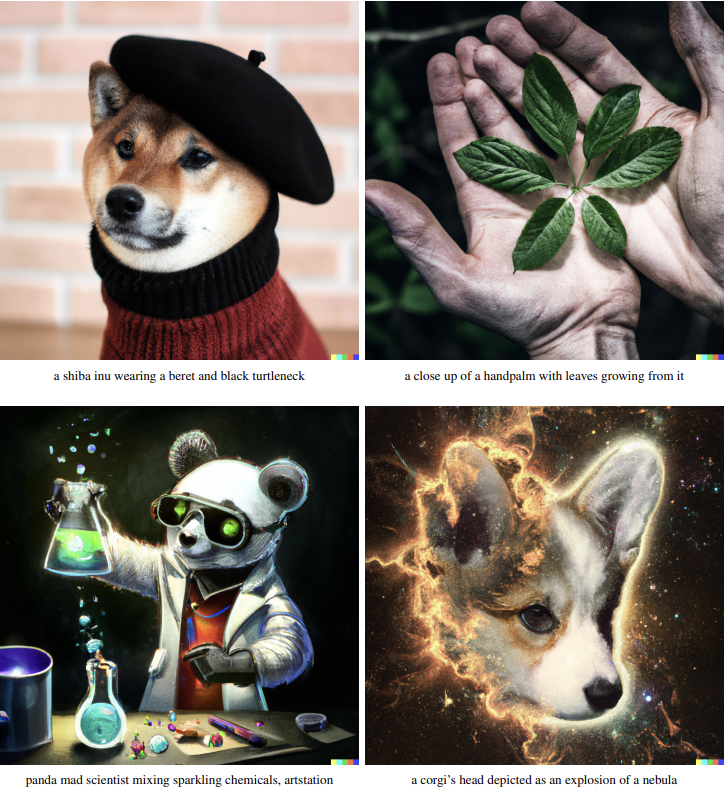

Since OpenAI announced DALLE-2, the attention on diffusion-based text-conditional image synthesis is largely increasing. In this post, I will cover recent trends from GAN-based image manipulation to DALLE-2. I will assume the readers are already fairly familiar with diffusion models.

# GAN-based image manipulation

Text-guided image manipulation is the task of modifying an image based on a given text prompt. As shown in the image above, we can change the topping of the pizza, make it to be a chocolate chip cookie, or perform a style transfer.

The studies that utilize pre-trained GAN for image manipulation can be sorted into the methods that perform latent optimization (w-learner) [1] and the methods that perform generator optimization (G-learner) [2]. The idea is basically that we can generate an image consistent with a given text prompt by optimizing either the latent vector or generator itself to maximize the similarity $s$ between the text and the image. Unlike the w-learner that performs latent space exploration only, G-learner changes the distribution of the generator, making it possible to generate the images in the unseen domain that are not included in the training set. However, GAN-inversion is needed to apply these approaches for real image editing.

### The cons

1. An optimization of either $w$ or $G$ is necessary.
2. The performance of GAN inversion serves as a bottleneck of overall manipulation quality.
3. As GANs struggle in complex datasets such as ImageNet, the methods can be applied to limited sorts of datasets.

# DiffusionCLIP

Drawbacks of GAN-based manipulation methods include the error in GAN inversion and the limited performance of GANs on complex datasets. It is known that DDIM allows deterministic sampling of diffusion models, and nearly perfect inversion can be achieved by inverting the generative ODE [6]. Furthermore, diffusion models tend to perform better on complex datasets than GANs. DiffusionCLIP [3] exploits these advantages. They fine-tune the parameters of ODE to maximize the CLIP similarity between a text and an image, which is similar to G-learner in GAN-based manipulation methods, allowing translation to out-of-domain.

### The cons

This still requires costly optimization of ODE.

# CLIP-guided Diffusion

Text-conditional generation can be performed by utilizing CLIP guidance to guide the reverse process of the unconditional diffusion model [4]:

\$\$
\begin{equation}
\hat \mu_\theta (x_t) = \mu_\theta(x_t) + s\Sigma\nabla x_t( I(x_t)\cdot T(c)).
\end{equation}
\$\$

$s$ is a scalar adjusting the strength of guidance, $\Sigma$ is the covariance matrix of a reverse process step, and $I$ and $T$ are image and text encoders of CLIP, respectively. Guided by text prompt, we can generate novel images or manipulate existing images by making them go through a forward process for a certain amount of steps and then pass through a reverse process. To use CLIP guidance, we would have to re-train CLIP on the noised dataset. Instead, we can calculate $\hat x_0$ from $\epsilon_\theta(x_t,t)$ and get the gradient of it with respect to CLIP similarity. Note that $\hat x_0$ can be differentiated by $\epsilon_\theta$, and $\epsilon_\theta$ can be differentiated by $x_t$. However, $\hat x_0$ is blurry or noisy, especially when $t$ is large, leading to worse performance than re-training CLIP, which is unfeasible in terms of computation.

### The cons

1. Without re-training CLIP, performance is sub-optimal.
2. Translation to out-of-domain is impossible as $\theta$ is not fine-tuned.

# GLIDE

GLIDE [5] from OpenAI is the de facto predecessor of DALLE-2 that shows very impressive results. Unlike the models we have covered so far that do not require large-scale datasets consisting of text and image pairs, GLIDE leverages hundreds of millions of pairs. The idea is simple. As they have paired dataset, they train a text-conditional model by feeding a text prompt into a massive diffusion model as a condition. Since the dataset is very large and has high diversity, it is hard to define an explicit out-of-domain, making versatile image generation or editing possible.

|  | GLIDE [5] | DiffusionCLIP [3] |
| --- | --- | --- |
| paired dataset | exists | doesn’t exist |
| test-time optimization | a single model is capable of generating images conditioned on various text prompts | necessary |

GLIDE has total 5B parameters, consisting of a 64 x 64 text-conditional diffusion model (3.5B) and a 4x upsampler (1.5B). Text-conditional model is augmented from ADM [6] by increasing the width to 512 channels (2.3B) and attaching a text encoder (1.2B).

The quality of generation, editing, and inpainting are pretty decent. GLIDE shows that it is possible to make surprising results by training a massive diffusion model on a huge paired dataset. Compared with of Ho et al. [7], which has 256M parameters, the model size increases by a factor of 20.

As GLIDE learns the relationship between texts and images, CLIP is not needed anymore for a text-conditional generation. Moreover, it is possible to make a diversity-fidelity trade-off without CLIP using classifier-free guidance, which is also used in DALLE-2.

### Classifier-free guidance

Classifier guidance, proposed by authors of ADM [6], is a widely used technique that enables conditional sampling of unconditional diffusion models and allows fidelity-diversity trade-off to improve sample quality:

\$\$
\begin{equation}
\hat \mu_\theta (x_t,c) = \mu_\theta(x_t) + s\Sigma \nabla x_t \log p_\phi (c \vert x_t),
\end{equation}
\$\$

where $\Sigma$ is a covariance matrix of $p_\theta(x_t\vert x_{t+1})$ and $s$ is the guidance scale. The larger $s$, the lower the diversity and the higher the performance. $c$ is a condition that could be a class label in ImageNet or a text in a text-conditional generation. $p_\phi (c\vert x_t)$ is a classifier that is trained on noised data. In classifier-free guidance [8], authors define classifier guidance in a slightly different manner using $\epsilon_\theta$ as follows:

\$\$
\begin{equation}
\hat \epsilon_\theta (x_t, c) = \epsilon_\theta(x_t) - s\beta_t \nabla x_t \log p_\phi (c \vert x_t),
\end{equation}
\$\$

where $\beta_t$ is $t$-th variance of the perturbation kernel $q(\mathbf x_t \vert \mathbf x_0$). Note that Eq. 2 and Eq. 3 are same except for the coefficient of the score. 

Song et al. [11] showed that we could obtain the score of a conditional generative model given the scores of a classifier and unconditional generative model. This is demonstrated by applying Bayes’ rule to the log probability of the classifier.

\$\$
\begin{equation}
\log p(c\vert x)=\log \frac{p(x\vert c)p(c)}{p(x)}
\end{equation}
\$\$

\$\$
\begin{equation}
\nabla\_x\log p(c\vert x)=\nabla\_x\log p(x\vert c) - \nabla\_x\log p(x)
\end{equation}
\$\$

Eq. 5 indicates that we can get the score of one distribution given the other two scores. Here, we obtain the log gradient of the classifier given scores of $p(x)$ and $p(x\vert c)$. Score and $\epsilon_\theta$ have the relation as follows:

\$\$
\begin{equation}
-\beta\_t\nabla\_x\log p\_t(x) \approx \epsilon\_\theta(x_t).
\end{equation}
\$\$

Therefore, if we know $\epsilon_\theta(x_t)$ and $\epsilon_\theta(x_t \vert c)$, we can obtain $\hat \epsilon_\theta(x_t)$ without relying on separate (and sometimes smaller) classifier:

\$\$
\begin{equation}
\hat \epsilon_\theta (x_t, c) = \epsilon_\theta(x_t) - s\beta_t \nabla x_t \log p_\phi (c \vert x_t) = \epsilon_\theta(x_t) + s(\epsilon_\theta(x_t, c) - \epsilon_\theta(x_t)).
\end{equation}
\$\$

For classifier-free guidance, authors train a single model capable of both unconditional and conditional generation by feeding null labels randomly.

Intuitively, we can exact stronger guidance by adding the difference vector between conditional and unconditional score vector multiplied by $s$ that is larger than 1. Classifier-free guidance enables fidelity-diversity trade-off without re-training CLIP on noised data. The authors show in an experiment that this approach outperforms conditional sampling using re-trained CLIP. Classifier-free guidance is also used in DALLE-2.

# DALLE-2

OpenAI’s DALLE-2 [9] is an upgraded version of GLIDE (it would be more natural to call it GLIDE-2). The generative process of DALLE-2 is hierarchical, where the first CLIP image embedding $z_i$ for a given text is synthesized by the prior diffusion model, and then the decoder diffusion model generates the image using a text and $z_i$. This is similar to the latent diffusion model [10], as they generate a latent representation containing essential information of an image before synthesizing the final result. An overall text-conditional model can be written as follows:

\$\$
\begin{equation}
p_\theta(x\vert y)=p_\theta(x,z_i\vert y)=p_\theta(x\vert z_i,y)p_\theta(z_i\vert y),
\end{equation}
\$\$

where $x$ and $y$ are an image and a text, respectively. The first equality is satisfied as CLIP image encoder is deterministic ($p(x,z_i \vert y)=p(z_i\vert x,y)p(x \vert y)=p(x\vert y)$). The second equality holds because of the chain rule. 

The hierarchical generative process of DALLE-2 has a noticeable advantage — we can generate various variations of a single image. Although previous diffusion models are also capable of doing so by inverting an image using DDIM inversion and making it go through the stochastic reverse process, the preservation of essential information is not guaranteed. In contrast, the decoder of DALLE-2 is conditioned on $z_i$ containing key information of an image and thus able to generate diverse variations of the image without loss of important properties by encoding the image into $z_i$ and feeding it into the decoder.

As shown in the table above, zero-shot FID on MS-COCO is not that much different compared to GLIDE. Although they also mention other advantages of DALLE-2, such as a superior diversity-fidelity trade-off to GLIDE, the quality of synthesis results, which is the reason why this model became popular, is not drastically improved from GLIDE. 

For the decoder, they use the 3.5B model of GLIDE and two 4x diffusion upsamplers allowing high resolution (1024x1024) synthesis. They use the same dataset as DALLE and GLIDE, which contains 250M text-image pairs. Considering the newly added prior model and one diffusion upsampler, the number of parameters has increased from GLIDE.

# Conclusion

In this post, I have covered the recent trends in text-conditional image synthesis based on diffusion models. First, I introduced the methods that utilize the pre-trained diffusion model and CLIP (DiffusionCLIP and CLIP-guided diffusion). We then looked at GLIDE and DALLE-2, which are able to generate or manipulate an image with stunning quality using hundreds of millions of annotated data and enormous model sizes. In my opinion, unlike GANs that require tricky min-max games, diffusion models simply optimize variational lower bound and therefore have superior scalability (which is the reason why I think GANs would not be the winner of this game in the long term). A big model arms race, which is already occurring in NLP, is also about to occur in image generation (come on, Google, it’s time to launch a 25B diffusion model trained on 12B pairs!). Not to mention that big tech companies already have the computing power and knowledge to train these models.

# References

*[1] Patashnik, Or, et al. "Styleclip: Text-driven manipulation of stylegan imagery." Proceedings of the IEEE/CVF International Conference on Computer Vision. 2021.*

*[2] Gal, Rinon, et al. "Stylegan-nada: Clip-guided domain adaptation of image generators." arXiv preprint arXiv:2108.00946 (2021).*

*[3] Kim, Gwanghyun, and Jong Chul Ye. "Diffusionclip: Text-guided image manipulation using diffusion models." arXiv preprint arXiv:2110.02711 (2021).*

*[4] Clay Mullis and Katherine Crowson. Clip-guided diffusion github repository. In [https://github.com/afiaka87/clip-guideddiffusion](https://github.com/afiaka87/clip-guideddiffusion).*

*[5] Nichol, Alex, et al. "Glide: Towards photorealistic image generation and editing with text-guided diffusion models." arXiv preprint arXiv:2112.10741 (2021).*

*[6] Dhariwal, Prafulla, and Alexander Nichol. "Diffusion models beat gans on image synthesis." Advances in Neural Information Processing Systems 34 (2021).*

*[7] Ho, Jonathan, Ajay Jain, and Pieter Abbeel. "Denoising diffusion probabilistic models." Advances in Neural Information Processing Systems 33 (2020): 6840-6851.*

*[8] Ho, Jonathan, and Tim Salimans. "Classifier-Free Diffusion Guidance." NeurIPS 2021 Workshop on Deep Generative Models and Downstream Applications. 2021.*

*[9] Ramesh, Aditya, et al. “Hierarchical Text-Conditional Image Generation with CLIP Latents.” In [https://cdn.openai.com/papers/dall-e-2.pdf](https://cdn.openai.com/papers/dall-e-2.pdf)*

*[10] Rombach, Robin, et al. "High-Resolution Image Synthesis with Latent Diffusion Models." arXiv preprint arXiv:2112.10752 (2021).*

*[11] Song, Yang, et al. "Score-based generative modeling through stochastic differential equations." arXiv preprint arXiv:2011.13456 (2020).*
